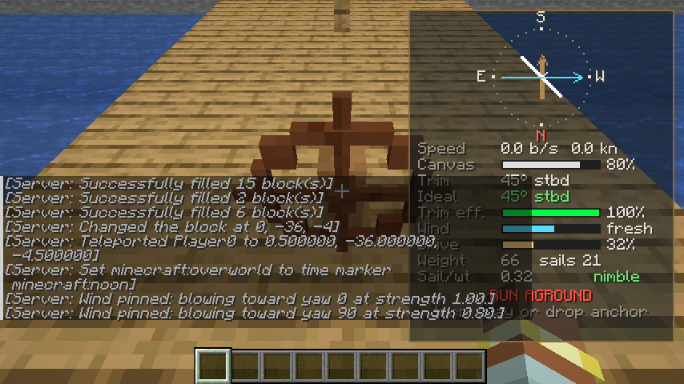

# Sea of Steves

A Fabric mod for **Minecraft Java Edition 26.3** that lets you build ships block by block on open
water and sail them.

Build any structure floating on water. If it doesn't touch land and it includes at least one
**Sail** and a **Ship's Wheel**, right-click the wheel and it becomes a ship entity you can drive.
Heavy ships need more sail. Wind changes from one area of the sea to the next, so you have to trim
your sails to keep your speed up. A HUD shows the wind, your sails and your speed.

> **Status: prototype (v0.1.0).** The core loop works and is covered by an automated in-game
> test. See [Known limitations](#known-limitations) before building your flagship.

| Built on the water | Underway with a tailwind |
|---|---|
|  |  |
| **Crosswind, sails trimmed to the ideal angle** | **Anchor dropped: the ship is blocks again** |
|  |  |

*These screenshots were taken automatically by the in-game test on CI. The chat text comes from
the commands the test uses to build the scene.*

## Features

| | |
|---|---|
| **Sail** block | Canvas. Every sail block adds sail area. |
| **Ship's Wheel** block | The helm. Right-click it to turn the structure into a ship and take control. Place it facing the direction you want to sail. |
| **Assembly rules** | Everything connected to the wheel becomes the ship. The ship must float on water, must not touch land (dirt, sand, stone, gravel, clay, ice, the sea floor and so on), must have at least one sail, and can have at most 4096 blocks. |
| **Weight vs. sail** | Each block has a weight: wool and sails are light, wood is medium, stone is heavy and metal is very heavy. Heavier ships push more water, so they need more sail to reach the same speed. |
| **Local wind** | Wind direction and strength vary across the world in wide air currents (a few hundred blocks across), with smaller eddies and gusts on top. The pattern drifts slowly over time. Rain strengthens the wind and thunderstorms strengthen it more. |
| **Sail trim** | Sails push along the direction they face. The keel stops the ship sliding sideways. You can't sail straight into the wind ("in irons"), and in a crosswind you need to angle the sails. The best trim is half the angle of the wind. |
| **Sailing HUD** | A wind rose that keeps your bow pointing up, showing the wind arrow, your sail (white) and the ideal sail angle (green). Below it are gauges for speed (blocks/s and knots), canvas, trim, ideal trim, trim efficiency, wind, drive, weight, sail count and sail-to-weight rating. |
| **Drop anchor** | Turns the ship back into ordinary blocks, snapped to the nearest 90° rotation, with everyone standing on deck. |

## Controls (while at the wheel)

| Key | Action |
|---|---|
| `W` / `S` | Let out / reef in the sails (canvas %) |
| `A` / `D` | Steer to port / starboard (you turn faster when you're moving) |
| `←` / `→` | Trim the sails to port / starboard |
| `R` | Drop anchor: turn the ship back into blocks (you must be nearly stopped) |
| `Shift` | Leave the ship (you'll end up in the water, so drop anchor first) |
| Right-click the ship | Board as a passenger (up to 8 people) |

You can rebind the arrow keys and `R` under **Options → Controls → Key Binds → Sea of Steves**.

## Recipes

| Result | Recipe |
|---|---|
| 4 × Sail | `string string string` / `wool wool wool` / `wool wool wool` (any colour of wool) |
| 1 × Ship's Wheel | `stick _ stick` / `_ planks _` / `stick _ stick` |

In Creative mode, both blocks are in the **Functional Blocks** tab.

## Commands

| Command | |
|---|---|
| `/sos wind` | Show the wind where you're standing. |
| `/sos wind set <toward-yaw> <strength>` | (Op) Set the same wind everywhere, for testing. The yaw is the direction the wind blows toward: `0` = south, `90` = west, `180` = north, `270` = east. Strength goes from `0` to `1.5`. |
| `/sos wind reset` | (Op) Return to the natural, local wind. |

---

## How to test it

### Requirements

* **Minecraft Java Edition 26.3**
* **Fabric Loader 0.19.5+** for 26.3 (use the installer at <https://fabricmc.net/use/installer/>)
* **Fabric API 0.161.0+26.3** (from [Modrinth](https://modrinth.com/mod/fabric-api) or [CurseForge](https://www.curseforge.com/minecraft/mc-mods/fabric-api))
* **Java 25**, only if you're building from source. The Minecraft launcher ships its own Java for playing.

### Option A: play it in your normal launcher

1. Get the mod jar in one of two ways:
   * Download it from GitHub Actions: open the latest green **build** run for this branch, then
     download the **SeaOfSteves** artifact and unzip it. Use `seaofsteves-0.1.0.jar`, not the
     `-sources` jar.
   * Or build it yourself: `./gradlew build`. The jar is written to `build/libs/seaofsteves-0.1.0.jar`.
2. Run the Fabric installer, choose **Minecraft 26.3** and install the client.
3. Put `seaofsteves-0.1.0.jar` and the Fabric API jar into your `.minecraft/mods` folder.
4. Start the **fabric-loader-26.3** profile in the Minecraft launcher.

### Option B: run it straight from the source code (for development)

```bash
./gradlew runClient          # launches Minecraft 26.3 with the mod loaded
./gradlew test               # unit tests for the sailing physics and wind model
./gradlew runClientGameTest  # automated in-game test (see below)
```

### Walkthrough: your first voyage

1. Create a **Creative** world. Find some ocean, or dig out a pool that's at least 3 deep and 20×20.
2. Build a small hull **on top of the water**, not touching the shore or sea floor. For example,
   a 5×11 deck of planks.
3. Put a **Ship's Wheel** near the back of the deck, facing the bow (place it while looking
   toward the front of the ship).
4. Put up a mast (fences work) and hang some **Sails** from it. They must be connected to the
   rest of the ship through other blocks.
5. Stand behind the wheel and **right-click it**. You'll see a message like "Ship assembled: 81
   blocks, 21 sails", and the sailing HUD appears on the right.
   * If it refuses, the message tells you why: touching land (with coordinates), no sail, not
     on water, or a chest/furnace on board.
6. Hold `W` to let out the canvas. Check the HUD's wind arrow:
   * **Tailwind** (arrow pointing up): keep the sails square and go fast.
   * **Crosswind**: press `←`/`→` until the white sail line matches the green ideal line.
     *Trim eff.* should reach 100%.
   * **Headwind**: you're *in irons*. Turn with `A`/`D` until the wind is on your side.
7. To get a predictable test, pin the wind: `/sos wind set 0 1` gives a steady wind blowing
   south. Then `/sos wind set 90 0.8` turns it into a crosswind from the east so you can
   practise trimming.
8. Try the weight mechanic: anchor, add a layer of stone or iron blocks, sail again, and compare
   *Sail/wt* and top speed. Then add more sails and compare again.
9. Press `S` to reef the sails and slow down, then press `R` to **drop anchor**. The ship turns
   back into blocks and you're standing on the deck. You can edit it and sail again.

### Automated in-game test

`./gradlew runClientGameTest` launches a real Minecraft 26.3 client and plays through the core
loop: it builds a pool, checks that a raft touching the pool wall is refused, builds a ship,
takes the wheel, sails with a tailwind, trims for a crosswind, turns, reefs, drops anchor and
checks that the blocks are back. It saves screenshots of each step to
`build/run/clientGameTest/screenshots/`. CI runs it on every push (the `client-gametest` job) and
uploads the screenshots as an artifact.

## How it works (for developers)

```
src/main/java/.../seaofsteves/
  block/        SailBlock, ShipWheelBlock (right-click → ShipAssembler)
  ship/         ShipAssembler   flood-fills from the wheel, checks the rules, lifts the blocks out
                ShipEntity      server-simulated ship: sails, trim, rudder, wind, collision, anchor
                ShipStructure   the captured blocks (saved to disk and synced to clients)
                BlockWeights    rough weight of each block
  physics/      SailPhysics     sail efficiency, drag and turning (pure Java, unit tested)
                WindField       seeded, localized wind currents
  network/      trim / anchor packets from the captain's client
  command/      /sos wind
src/client/java/.../client/
  ShipRenderer  draws every captured block, rotated with the ship's heading
  SailingHud    the wind rose and gauges
  ShipControls  trim and anchor key binds
src/gametest/   the automated in-game test
```

* The server is in charge of the ship: it reads the captain's `W`/`A`/`S`/`D` input and the trim
  keys, moves the ship, and syncs its heading, speed, wind and sail state to clients for the HUD.
* Sailing model: `efficiency = max(0, cos(wind − trim)) × cos(trim)` and
  `acceleration = (0.12 × sails × canvas × wind × efficiency − drag) / weight`. Drag grows with
  weight and with speed squared.

## Known limitations

This is a prototype. These are the main gaps before it's a full mod:

* **You ride the ship; you can't walk on it.** Everyone on board has a fixed spot on deck, and
  you can't break or place blocks on a moving ship. Drop anchor to edit it.
* **No blocks with inventories yet.** Chests, furnaces, barrels and other block entities block
  assembly, so their contents can't be lost.
* The ship stays at a fixed height: no waves, sinking or waterfalls. Collision only checks the
  ship's own blocks against solid world blocks, and entities don't collide with the hull.
* Very large ships (thousands of blocks) are drawn block by block every frame, which is slow.
* It has only been tested in single-player so far. It's designed to be server-authoritative
  for multiplayer, but that hasn't been exercised yet.
* The textures are placeholder art.

## License

MIT
