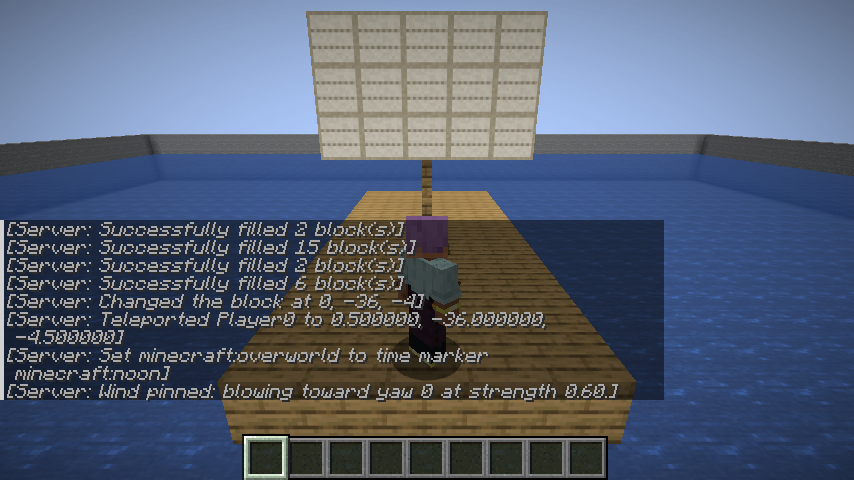
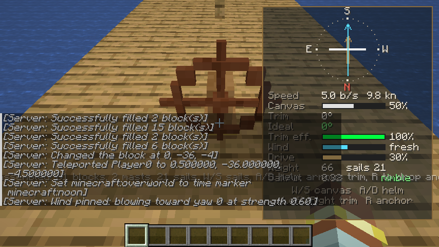
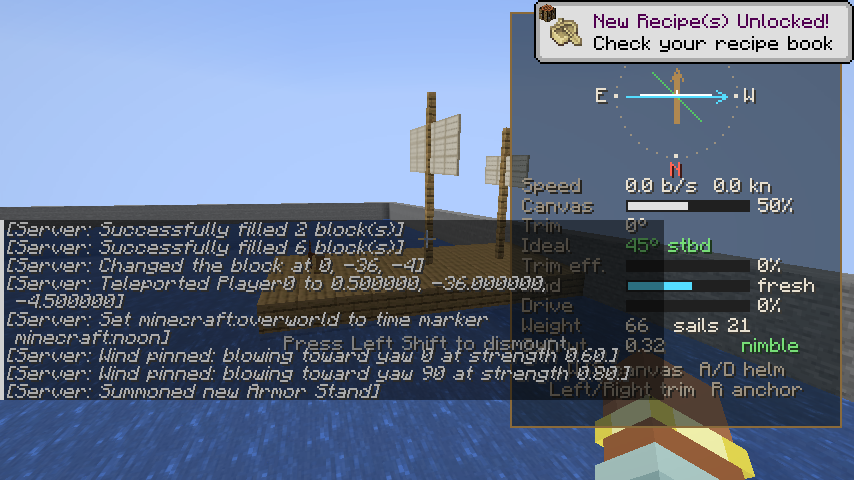
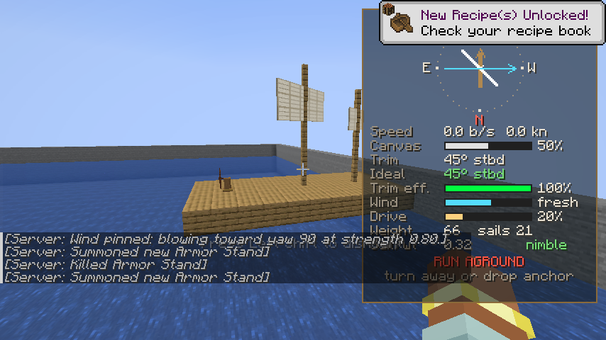
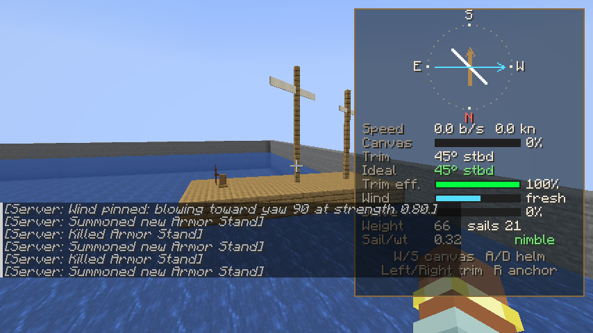
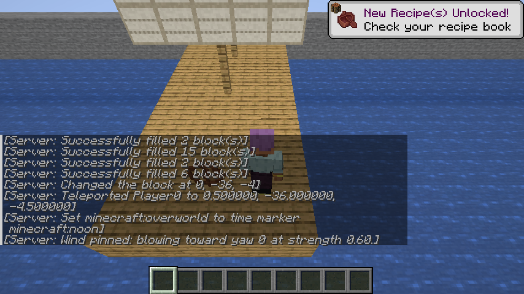
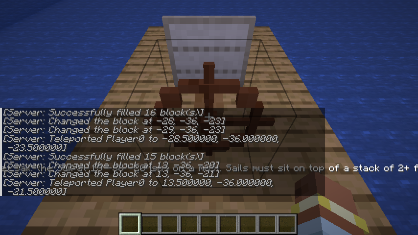
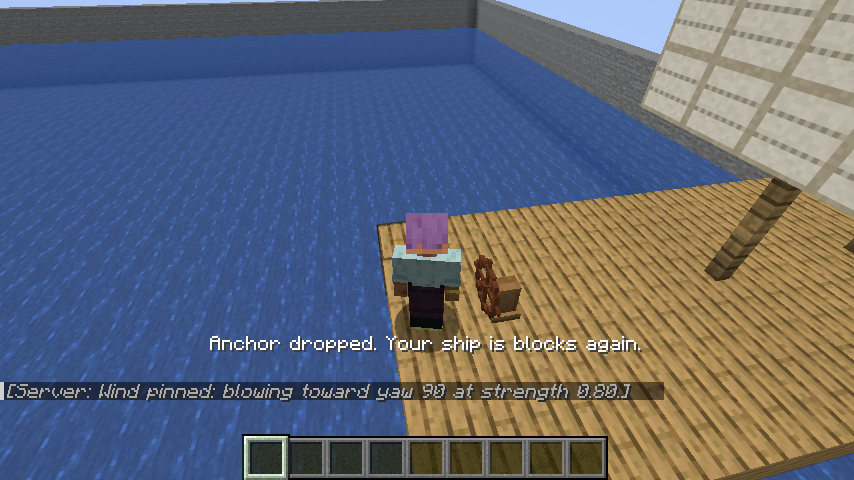

# Sea of Steves

A Fabric mod for **Minecraft Java Edition 26.3** that lets you build ships block by block on open
water and sail them.

Build any structure floating on water. Give it at least one **mast** (a stack of fences with a
rectangle of **Sail** blocks on top) and a **Ship's Wheel**. If it doesn't touch land,
right-click the wheel and it becomes a ship entity you can drive. The sails swing around their
masts as you trim them.
Heavy ships need more sail. Wind changes from one area of the sea to the next, so you have to trim
your sails to keep your speed up. A HUD shows the wind, your sails and your speed.

The ship is solid while it sails. Walk around its deck, bump into its masts and ride along as it
rolls over the waves. The captain stays at the wheel.

> **Status: prototype (v0.1.0).** The core loop works and is covered by an automated in-game
> test. See [Known limitations](#known-limitations) before building your flagship.

| Built on the water | Underway with a tailwind |
|---|---|
|  |  |
| **Sails square to the ship** | **Trimmed 45° to starboard for a crosswind** |
|  |  |
| **Canvas reefed: sails furled up to their yards** | **Walking the deck while it sails** |
|  |  |
| **A loose sail isn't a mast: assembly refused** | **Anchor dropped: the ship is blocks again** |
|  |  |

*These screenshots were taken automatically by the in-game test on CI. The chat text comes from
the commands the test uses to build the scene.*

## Features

| | |
|---|---|
| **Sail** block | A thin panel of canvas that faces you when you place it. Every sail block on a mast adds sail area. |
| **Masts** | A mast is a stack of **2 or more fences** with a **flat, filled rectangle of Sail blocks** resting on top. Any size works, from 1×1 up. A ship can have several masts. Sails that aren't on a mast, or aren't a flat rectangle, stop the ship from assembling, and the message says which sail and why. |
| **Sails you can see working** | While sailing, each sail swings around its mast to match your trim, and the mast is drawn running up through the middle of the sail. Reefing (`S`) rolls the canvas up toward the top of the sail. Letting it out (`W`) drops it back down. |
| **Ship's Wheel** block | The helm. Right-click it to turn the structure into a ship and take control. Place it facing the direction you want to sail. |
| **Assembly rules** | Everything connected to the wheel becomes the ship. The ship must float on water, must not touch land (dirt, sand, stone, gravel, clay, ice, the sea floor and so on), must have at least one mast, and can have at most 4096 blocks. |
| **Weight vs. sail** | Each block has a weight: wool and sails are light, wood is medium, stone is heavy and metal is very heavy. Heavier ships push more water, so they need more sail to reach the same speed. |
| **Local wind** | Wind direction and strength vary across the world in wide air currents (a few hundred blocks across), with smaller eddies and gusts on top. The pattern drifts slowly over time. Rain strengthens the wind and thunderstorms strengthen it more. |
| **Sail trim** | Sails push along the direction they face. The keel stops the ship sliding sideways. You can't sail straight into the wind ("in irons"), and in a crosswind you need to angle the sails. The best trim is half the angle of the wind. |
| **Sailing HUD** | A wind rose that keeps your bow pointing up, showing the wind arrow, your sail (white) and the ideal sail angle (green). Below it are gauges for speed (blocks/s and knots), canvas, trim, ideal trim, trim efficiency, wind, drive, weight, sail count and sail-to-weight rating. |
| **Walkable decks** | A sailing ship's blocks are solid. Players and mobs can stand on the deck, walk around, and bump into masts and railings, and the ship carries them along and turns them with it. A moving hull shoves swimmers and mobs aside. |
| **Waves** | The ship rises and falls on a swell driven by the local wind, and rocks bow-to-stern and side-to-side depending on the waves under it. Calm seas are gentle and gales are choppy. Under sail it also heels away from the wind. Heavier ships move more slowly and settle more gradually. |
| **Drop anchor** | Turns the ship back into ordinary blocks, snapped to the nearest 90° rotation, with everyone standing on deck. |

## Controls

**Right-click the wheel** of a sailing ship to take the helm, and press `Shift` to step away
from it onto the deck. At the helm:

| Key | Action |
|---|---|
| `W` / `S` | Let out / reef in the sails (canvas %) |
| `A` / `D` | Steer to port / starboard (you turn faster when you're moving) |
| `←` / `→` | Trim the sails to port / starboard |
| `R` | Drop anchor: turn the ship back into blocks (you must be nearly stopped) |
| `Shift` | Step away from the wheel. You stand on the deck and can walk around while the ship keeps sailing. |

You can rebind the arrow keys and `R` under **Options → Controls → Key Binds → Sea of Steves**.

## Recipes

| Result | Recipe |
|---|---|
| 4 × Sail | `string string string` / `wool wool wool` / `wool wool wool` (any colour of wool) |
| 1 × Ship's Wheel | `stick _ stick` / `_ planks _` / `stick _ stick` |

In Creative mode, both blocks are in the **Functional Blocks** tab.

## Commands

| Command | |
|---|---|
| `/sos wind` | Show the wind where you're standing. |
| `/sos wind set <toward-yaw> <strength>` | (Op) Set the same wind everywhere, for testing. The yaw is the direction the wind blows toward: `0` = south, `90` = west, `180` = north, `270` = east. Strength goes from `0` to `1.5`. |
| `/sos wind reset` | (Op) Return to the natural, local wind. |

---

## How to test it

### Requirements

* **Minecraft Java Edition 26.3**
* **Fabric Loader 0.19.5+** for 26.3 (use the installer at <https://fabricmc.net/use/installer/>)
* **Fabric API 0.161.0+26.3** (from [Modrinth](https://modrinth.com/mod/fabric-api) or [CurseForge](https://www.curseforge.com/minecraft/mc-mods/fabric-api))
* **Java 25**, only if you're building from source. The Minecraft launcher ships its own Java for playing.

### Option A: play it in your normal launcher

1. Get the mod jar in one of two ways:
   * Download it from GitHub Actions: open the latest green **build** run for this branch, then
     download the **SeaOfSteves** artifact and unzip it. Use `seaofsteves-0.1.0.jar`, not the
     `-sources` jar.
   * Or build it yourself: `./gradlew build`. The jar is written to `build/libs/seaofsteves-0.1.0.jar`.
2. Run the Fabric installer, choose **Minecraft 26.3** and install the client.
3. Put `seaofsteves-0.1.0.jar` and the Fabric API jar into your `.minecraft/mods` folder.
4. Start the **fabric-loader-26.3** profile in the Minecraft launcher.

### Option B: run it straight from the source code (for development)

```bash
./gradlew runClient          # launches Minecraft 26.3 with the mod loaded
./gradlew test               # unit tests for the sailing physics and wind model
./gradlew runClientGameTest  # automated in-game test (see below)
```

### Walkthrough: your first voyage

1. Create a **Creative** world. Find some ocean, or dig out a pool that's at least 3 deep and 20×20.
2. Build a small hull **on top of the water**, not touching the shore or sea floor. For example,
   a 5×11 deck of planks.
3. Put a **Ship's Wheel** near the back of the deck, facing the bow (place it while looking
   toward the front of the ship).
4. Build a **mast**: stack at least 2 fences on the deck. Then build the sail on top of it as a
   flat rectangle of **Sail** blocks, one block thick, with its bottom row resting on the top
   fence. For example, 5 wide × 3 tall across the ship. Face the bow while placing sails so the
   canvas faces forward. Add more masts if you like.
5. Stand behind the wheel and **right-click it**. You'll see a message like "Ship assembled: 81
   blocks, 2 masts, 21 sails", and the sailing HUD appears on the right.
   * If it refuses, the message tells you why, with coordinates: touching land, a sail that
     isn't on a mast (or isn't a flat rectangle), a mast shorter than 2 fences, no mast at all,
     not on water, or a chest/furnace on board.
6. Hold `W` to let out the canvas. Check the HUD's wind arrow:
   * **Tailwind** (arrow pointing up): keep the sails square and go fast.
   * **Crosswind**: press `←`/`→` until the white sail line matches the green ideal line.
     *Trim eff.* should reach 100%. Look up at your masts: the sails swing to match.
   * **Headwind**: you're *in irons*. Turn with `A`/`D` until the wind is on your side.
7. To get a predictable test, pin the wind: `/sos wind set 0 1` gives a steady wind blowing
   south. Then `/sos wind set 90 0.8` turns it into a crosswind from the east so you can
   practise trimming.
8. Try the weight mechanic: anchor, add a layer of stone or iron blocks, sail again, and compare
   *Sail/wt* and top speed. Then add more sails and compare again.
9. Let out some sail, press `Shift` to step away from the wheel, and walk around the deck while
   it sails and rocks on the waves. Right-click the wheel to take the helm again.
10. Press `S` to reef the sails and slow down, then press `R` to **drop anchor**. The ship turns
   back into blocks and you're standing on the deck. You can edit it and sail again.

### Automated in-game test

`./gradlew runClientGameTest` launches a real Minecraft 26.3 client and plays through the core
loop: it builds a pool and checks that a raft touching the pool wall and a raft with a loose
(unmasted) sail are both refused. It then builds a two-masted ship, checks that both masts are
recognised, takes the wheel and sails with a tailwind. It checks that the hull heaves on the waves, then
steps away from the wheel and checks that the player stays standing on the moving deck. It then
retakes the wheel, trims for a crosswind, turns, reefs, drops anchor and checks that the blocks
are back. Along the way it photographs the rig from beside the ship with the sails square,
trimmed and furled. It saves screenshots of each step to
`build/run/clientGameTest/screenshots/`. CI runs it on every push (the `client-gametest` job) and
uploads the screenshots as an artifact.

## How it works (for developers)

```
src/main/java/.../seaofsteves/
  block/        SailBlock, ShipWheelBlock (right-click → ShipAssembler)
  ship/         ShipAssembler   flood-fills from the wheel, checks the rules, lifts the blocks out
                ShipRigging     finds masts (fence stacks) and their sail rectangles
                ShipEntity      server-simulated ship: sails, trim, rudder, wind, waves, carrying riders, anchor
                ShipHull        rotated collision boxes for the ship's blocks
                ShipCollisions  adds hull boxes to entity collision (via mixin)
                ShipStructure   the captured blocks (saved to disk and synced to clients)
                BlockWeights    rough weight of each block
  physics/      SailPhysics     sail efficiency, drag and turning (pure Java, unit tested)
                WindField       seeded, localized wind currents
                WaveField       wind-driven swell used for heave, pitch and roll
  mixin/        Entity collision hook; no "flying" kick for players standing on a deck
  network/      trim / anchor packets from the captain's client
  command/      /sos wind
src/client/java/.../client/
  ShipRenderer  draws the ship's blocks, turned, rocking, with sails swung to the trim angle
  SailingHud    the wind rose and gauges
  ShipControls  trim and anchor key binds
  mixin/        carries the local player with the deck they stand on
src/gametest/   the automated in-game test
```

* The server is in charge of the ship: it reads the captain's `W`/`A`/`S`/`D` input and the trim
  keys, moves the ship, and syncs its heading, speed, wind and sail state to clients for the HUD.
* Sailing model: `efficiency = max(0, cos(wind − trim)) × cos(trim)` and
  `acceleration = (0.12 × sails × canvas × wind × efficiency − drag) / weight`. Drag grows with
  weight and with speed squared.
* Walkable decks: every entity movement asks the level for nearby collision shapes, and a mixin
  adds the ship's block boxes, rotated with its heading. Players move themselves on their own
  client, so the client carries the local player with the deck and the server carries mobs and
  items. The server trusts the player's position on deck rather than re-checking it against the
  hull, because its view of the ship is a few ticks ahead of the client's.
* Waves: the hull samples wave height under its bow, stern and sides. Heave (up and down) moves
  the real ship, collision boxes included. Pitch and roll are applied when the ship is drawn.

## Known limitations

This is a prototype. These are the main gaps before it's a full mod:

* Sails have no collision while sailing (they swing, so you can't stand on them), and the
  physics counts every sail block the same whichever way it faces. Build sails across the ship
  (facing the bow): they swing relative to how they were built, so a sail built along the keel
  starts out side-on.
* **You can't build on a sailing ship.** You can walk on it, but breaking or placing blocks
  affects the world, not the ship. Drop anchor to edit it.
* Collision boxes can't rotate. At headings between the four compass directions, each block's
  collision box grows to cover its rotated footprint (up to ~0.2 blocks wider at 45°). Pitch
  and roll are visual only (at most 4°), so the walkable deck stays level.
* **No blocks with inventories yet.** Chests, furnaces, barrels and other block entities block
  assembly, so their contents can't be lost.
* No sinking, capsizing or waterfalls, and ships don't collide with each other.
* Minecraft's water stays flat, so the waves only move ships, not the water surface.
* Very large ships (thousands of blocks) are drawn block by block every frame, which is slow.
* It has only been tested in single-player so far. Walking on the deck is designed to work in
  multiplayer, including with lag, but that hasn't been tested yet.
* The textures are placeholder art.

## License

MIT
